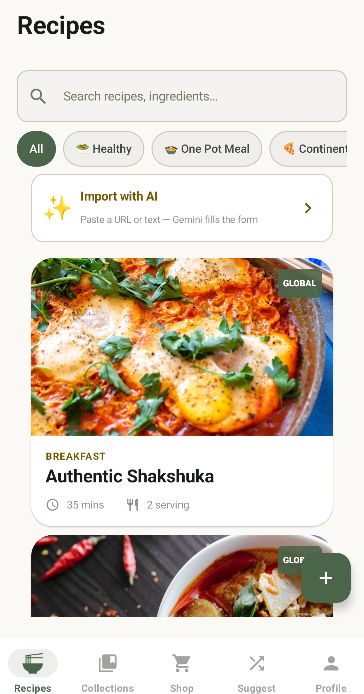
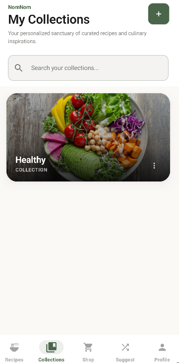
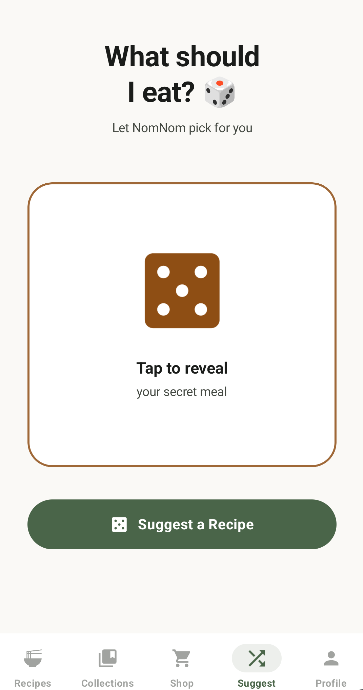
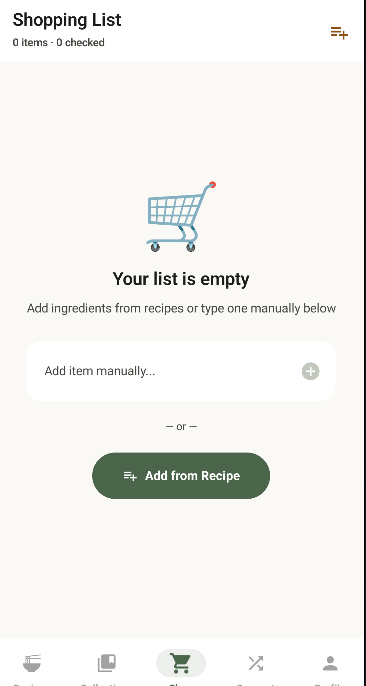
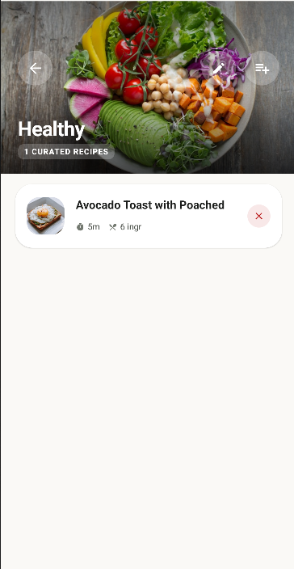
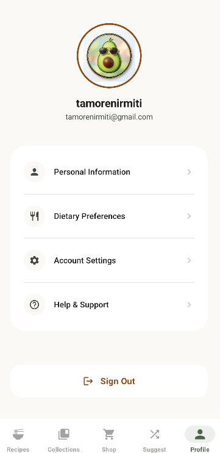

# 🍳 NomNom: The Smart AI Recipe Companion

[](https://kotlinlang.org/)
[](https://developer.android.com/jetpack/compose)
[](https://deepmind.google/technologies/gemini/)
[](https://supabase.com/)

**NomNom** is a premium, AI-powered recipe management application built for the modern kitchen. It leverages Google's **Gemini 2.0 Flash** to instantly transform messy blog posts and URLs into beautifully structured recipes, all wrapped in a high-polish "Culinary Serenity" design system.

---

## 📱 App Preview

| Recipes Home | Collections Sanctuary | Smart Suggestions |
| :---: | :---: | :---: |
|  |  |  |

| Shopping List | Collection Detail | User Profile |
| :---: | :---: | :---: |
|  |  |  |

---

## ✨ Core Features

### 🪄 Instant AI Import
Never manually type a recipe again. Paste any text or URL, and our **Gemini 2.0 Integration** will extract ingredients, steps, and metadata (prep time, servings, category) with near-perfect accuracy.

### 📂 Curated Collections
Organize your culinary journey into personalized collections. Whether it's "Healthy Starts" or "One Pot Wonders," our editorial glassmorphism UI makes your library feel like a high-end cookbook.

### 🎲 "What Should I Eat?"
Stuck in a food rut? Let NomNom pick for you with our interactive **Suggest** feature. Spin the dice and let our algorithm (or chance!) decide your next masterpiece.

### 🛒 Synchronized Shopping
Automatically aggregate ingredients from multiple recipes into a single, checkable shopping list. Categorized by aisle, it’s the ultimate companion for your grocery runs.

### 👤 Personalized Profiles
Customize your experience with unique "Veggie Avatars," track your cooking stats, and set your dietary preferences to tailor the app to your lifestyle.

---

## 🛠 Tech Stack

- **UI Framework**: [Jetpack Compose](https://developer.android.com/jetpack/compose) with Material 3.
- **Language**: [Kotlin](https://kotlinlang.org/) (Coroutines, Flow, Serialization).
- **Backend-as-a-Service**: [Supabase](https://supabase.com/) (PostgreSQL, Auth, RLS).
- **Generative AI**: [Google Gemini 2.0 Flash](https://aistudio.google.com/) for structured data extraction.
- **Image Loading**: [Coil](https://coil-kt.github.io/coil/) with custom fallback gradients.
- **Design System**: Custom **Culinary Serenity** tokens (Sage, Terracotta, and Linen palettes).

---

## 📖 Learn More

Want to see the engineering behind the app? Check out our:
👉 [**Technical Walkthrough**](TECHNICAL_WALKTHROUGH.md)

---

## 🚀 Getting Started

1. **Clone the repo**:
   ```bash
   git clone https://github.com/yourusername/NomNom.git
   ```
2. **Setup Supabase**: Create a project and run the scripts in `backend/supabase_schema.sql`.
3. **Configure API Keys**: Add your `SUPABASE_URL`, `SUPABASE_ANON_KEY`, and `GEMINI_API_KEY` to your `local.properties`.
4. **Run**: Open in Android Studio and hit **Run**!

---

*Designed & Developed with ❤️ by Chef NomNom.*
